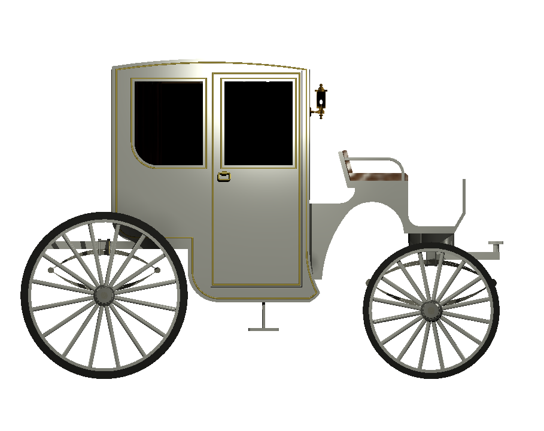
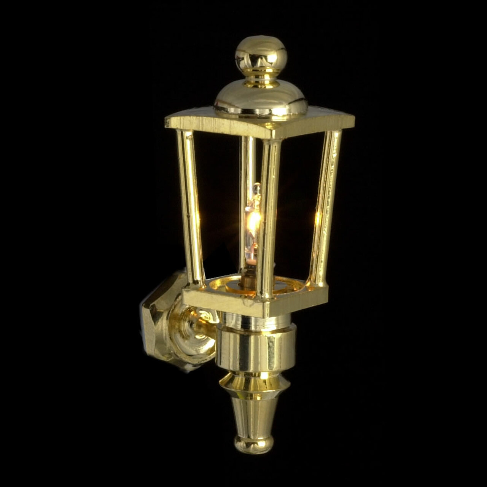

# Proiectarea unei trăsuri folosind aplicația AutoCAD

Acest repository conține fișierele și documentația pentru proiectul <i>”Trăsură”</i>, ce constă în proiectarea unei trăsuri folosind aplicația <i>AutoCAD</i>. Proiectul a fost realizat pentru cursul de <i>Proiectare Asistată de Calculator</i> în anul I, semestrul 2, în cadrul <i>Facultății de Matematică și Informatică - Univeristatea din București</i>.

  
## Proiectarea componentelor
### Cuprins
<ol type = 1>
  <li>Cabina</li>
    <ol type=I>
      <li>Pereții</li>
      <li>Treapta</li>
      <li>Mânerul</li>
      <li>Ușile laterale</li>
      <li>Canapeaua</li>
      <li>Draperiile</li>
      <li>Ușile laterale</li>
    </ol>
  <li>Scaunul vizitiului</li>
  <li>Felinarul</li>
  <li>Osia din față</li>
  <li>Osia din spate</li>
  <li>Roțile</li>
</ol>

## Adăugarea materialelor

Pentru ca obiectele să devină realiste și pentru a putea realiza randarea, este necesară adăugarea unor materiale. Materialele utilizate în acest proiect sunt următoarele:

| Nr. crt. | Denumire material | Categorie | Obiectele cărora li s-a atribuit materialul |
| --- | --- | --- |---|
| 1. | Velvet - Red 1 | Fabric | Draperie |
|2.| Brown |Fabric: Leather| Canapeaua din interiorul cabinei; Canapea vizitiu|
|3. |Lacquer - White| Finish| Pereții cabinei; Scaunul vizitiului; Osii; Sistemul de prindere a hamurilor|
|4. |Wax - Red on Light Wood| Finish| Galerie|
|5. |Clear| Glass| Geamuri cabină; Geamuri felinar|
|6. |Light Bulb - On| Glass |Becuri|
|7. |Brass - Satin Brushed Heavy| Metal |Felinar|
|8. |Bronze - Polished| Metal |Becuri|
|9. |Semi - Polished |Metal: Aluminium |Roți direcție; Suporturi suspensii; Butucii roților|
|10. |Steel - Cast| Metal: Steel| Suspensii; Marginile osiilor|
|11.| Satin - Gold |Metallic Paint |Decorațiuni exterioare|
|12. |Rubber - Black| Miscellaneous| Cauciucuri roți|

### Trăsura după aplicarea materialelor:

## Animarea trăsurii

Pentru animarea trăsurii este necesară crearea unor block-uri. Fiecare componentă care se mișcă va reprezenta un block, pentru care se setează ca pickpoint punctul în care este generată mișcarea. Am creat astfel 3 componente: ușa felinarului, ușile cabinei și osia din față.

## Randarea

Pentru a putea utiliza funcția RENDER, am adăugat 7 surse de lumină: 2 în față, 2 în spate, 2 în lateral și una în interiorul cabinei. Pentru cele din exterior am folosit WEB LIGHT, acestea având lumină caldă și intensitatea luminoasă de 100 Cd, iar pentru cea din interior am folosit o sursă de lumină de tip POINT, având aceleași setări pentru culoare ca cele anterioare și intensitatea luminoasă de 250 Cd. După adăugarea acestor lumini, am folosit Render to Size 1280 x 720 px - HDTV, selectând opțiunea Coffee-Break. 

### Poziționarea surselor de lumină

  

## Trăsura finală

  
  
  

  
  

## Planșe tehnice
Fiecare schiță poate fi reprezentată pe o planșă tehnică, ce conține un tabel cu detalii referitoare la proiectant. În acest scop, am creat un template ce poate fi aplicat fiecărei schițe.

  

## Tehnologii utilizate
În realizarea acestui proiect, am folosit versiunea AutoCAD 2021, fișierele fiind însă salvate în versiunea AutoCAD 2013, în format .dwg pentru proiectare și .dwt pentru template-uri.

## Repere
Ca repere în proiectare am folosit următoarele imagini:

  
  

  
  

#### Surse:

* https://www.geriwalton.com/vehicle-titles-origins-descriptions-1700-1800s-l-r/
* https://ro.pinterest.com/pin/383439355743827622/
* https://www.wikiwand.com/en/Leaf_spring
* https://shop.greenleafdollhouses.com/dollhouse-wall-lights-carriage-lamp/