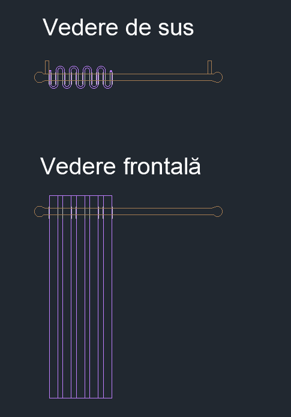
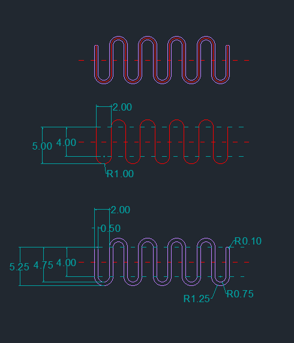
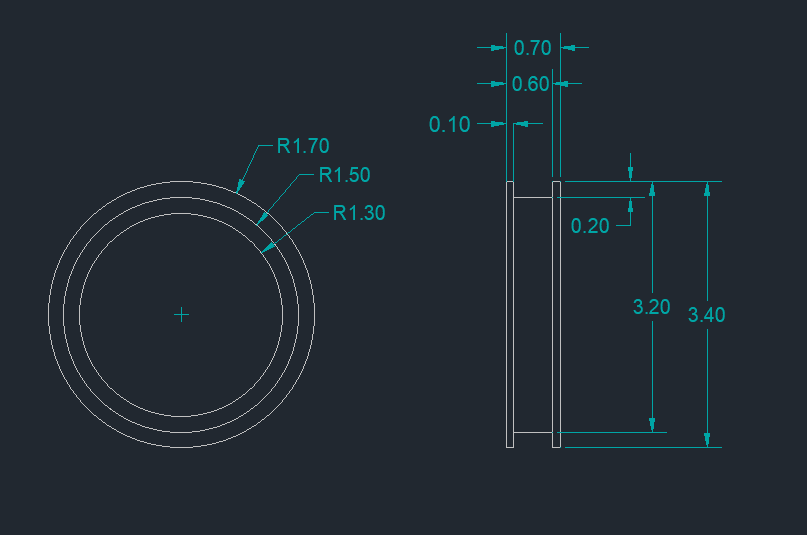
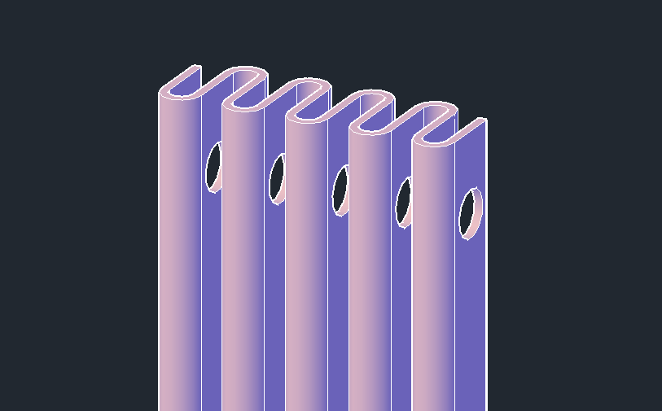
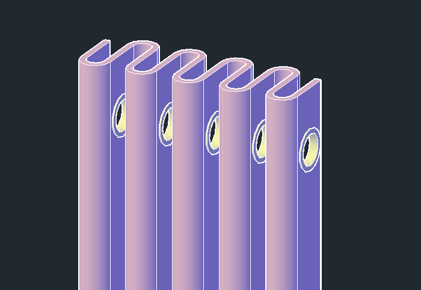
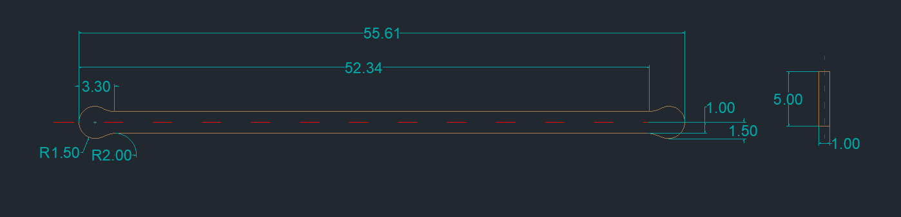
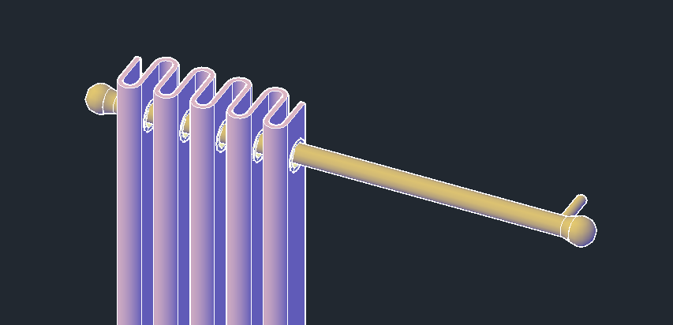

## Draperiile

Draperiile au fost create pornind de la linia șerpuită roșie, căreia i-am aplicat un offset de 0.25 pe ambele părți, după care am folosit <i>PRESSPULL</i> pentru a-i adăuga dimensiune.

  
    

Inelele de prindere au fost create folosind <i>PRESSPULL</i>, pornind de la 3 cercuri concentrice, pe care le-am multiplicat cu comanda <i>COPY</i>.
  

  
    
  

Pentru a crea galeria, am pornit de la următoarea schiță 2D, am îmbinat liniile într-un polyline cu comanda <i>JOIN</i> și apoi am folosit <i>REVOLVE</i>. Picioarele galeriei sunt 
create, de asemenea, folosind <i>REVOLVE</i>.
  

  

   

   

