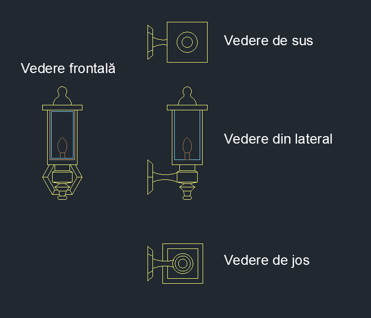
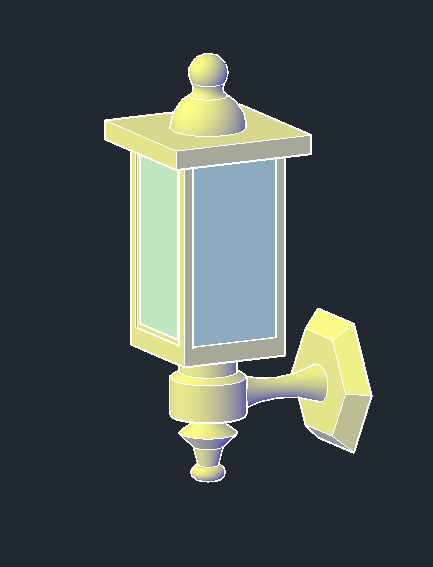
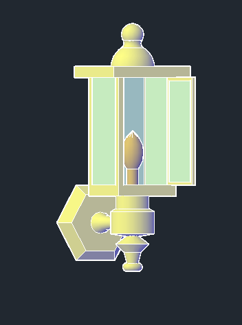
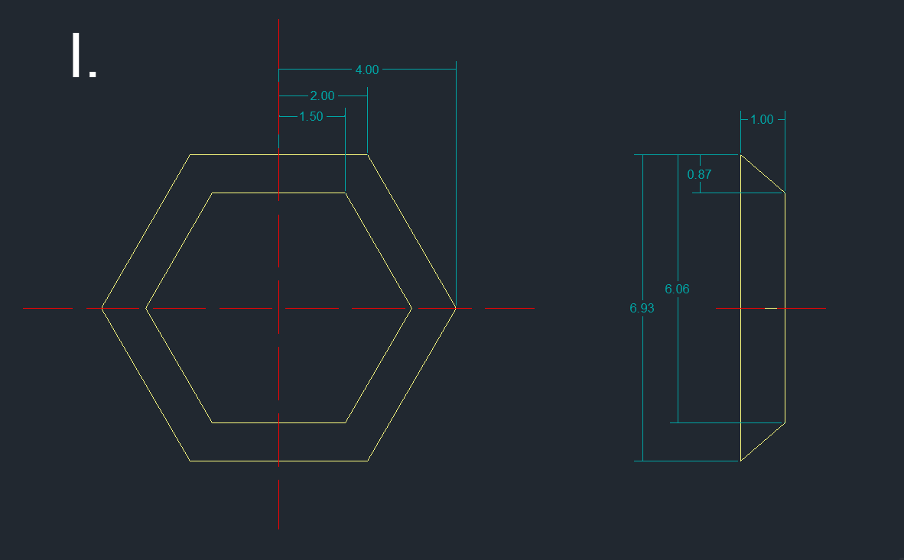
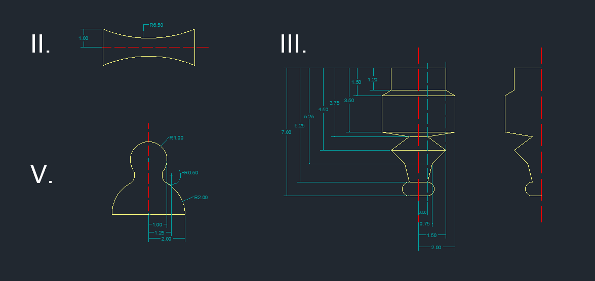
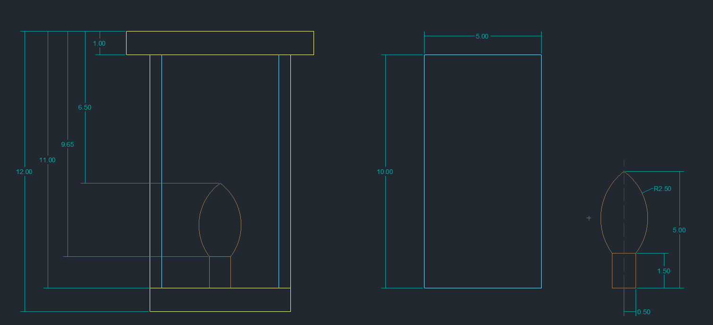
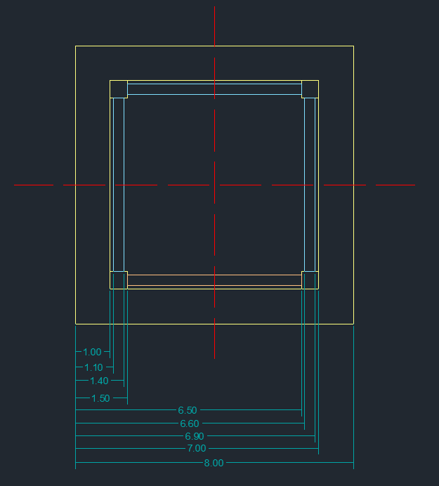

## Felinarul

  Pentru realizarea felinarului în format tridimensional a fost necesară divizarea lui în 5 componente.

  
  
  

  #### Componenta I

Am creat două hexagoane înscrise în cercuri concentrice, le-am plasat la distanța de o unitate unul față de celălalt, după care am folosit comanda <i>LOFT</i> pentru a obține corpul 3D.

  #### Componentele II, III și V
 

Cele 3 componente se aseamănă prin faptul că sunt create folosind <i>REVOLVE</i>. Pentru schițele 2D am folosit comenzile <i>LINE, ARC, FILLET, TRIM, JOIN.</i>

  
  

#### Componenta IV

  Corpul felinarului și ușa acestuia au fost realizate cu ajutorul comenzilor <i>EXTRUDE</i> și <i>PRESSPULL</i>, iar pentru bec am folosit <i>REVOLVE</i>.

  
  

