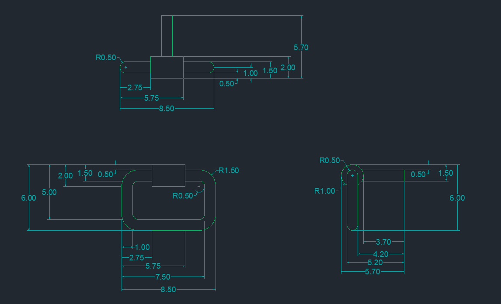

## Mânerul

  Mânerul a fost realizat conform dimensiunilor din figura următoare. În desenele 2D am folosit <i>LINE, CIRCLE, OFFSET,</i> iar în proiectarea 3D am utilizat 
<i>REVOLVE</i> pentru suport și <i>SWEEP</i> pentru mâner.

  
  

