## Osia din față

  Pe osia din față sunt suprapuse următoarele componente: două roți pentru direcție, un sistem de prindere a hamurilor, suspensii și un sistem de prindere a suspensiilor. În figura următoare se poate observa modul în care acestea sunt poziționate.

  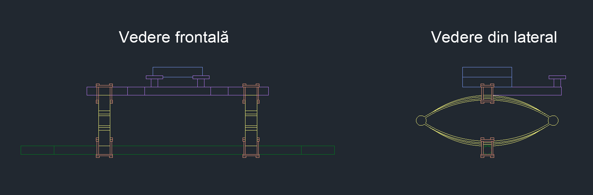

### Roți de direcție

  Am creat desenele 2D ale roților de direcție folosind <i>CIRCLE, OFFSET, LINE</i> și 
<i>TRIM</i>, după care am utilizat <i>PRESSPULL</i> pentru amândouă.

  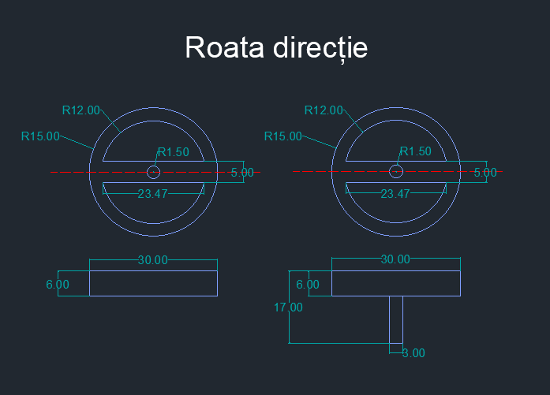
  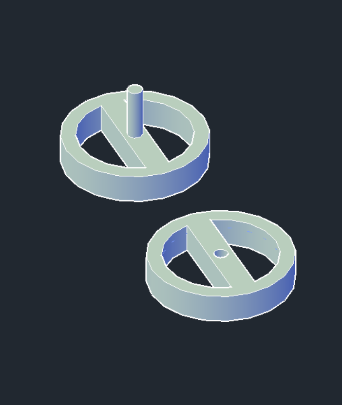

### Sistemul de prindere a hamurilor

Componenta pe care se atașează hamurile cailor a fost creată astfel: în 2D am folosit <i>LINE</i> și <i>CIRCLE</i>, iar în 3D am folosit <i>PRESSPULL</i> pornind de la schița ce corespunde perspectivei de sus, pentru a adăuga grosimea de 5 unități.

  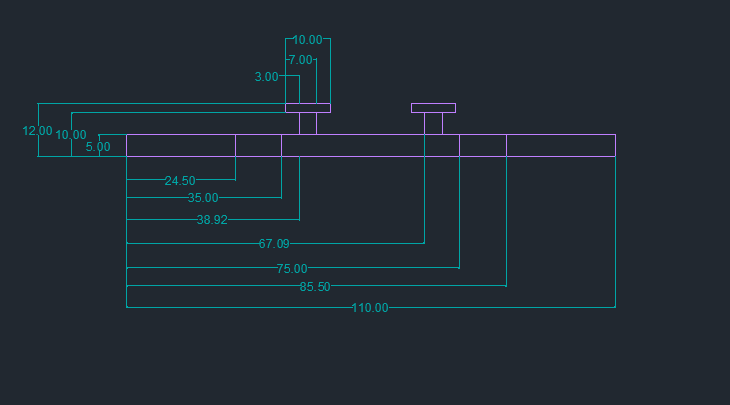
  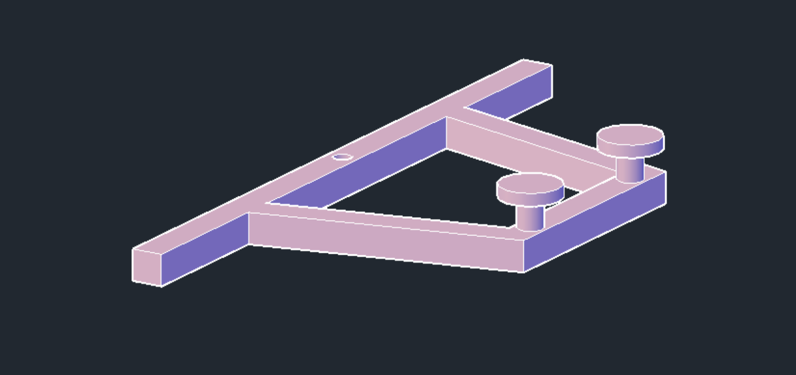

### Suspensiile

În realizarea suspensiilor, am folosit <i>ARC, CIRCLE, LINE</i> și <i>MIRROR</i> pentru proiectarea 2D, iar pentru crearea obiectului 3D am folosit <i>PRESSPULL</i>.

  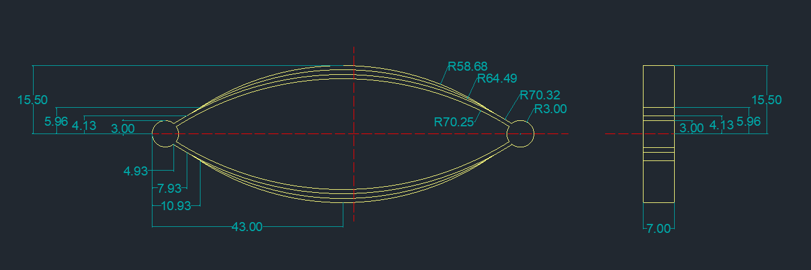
  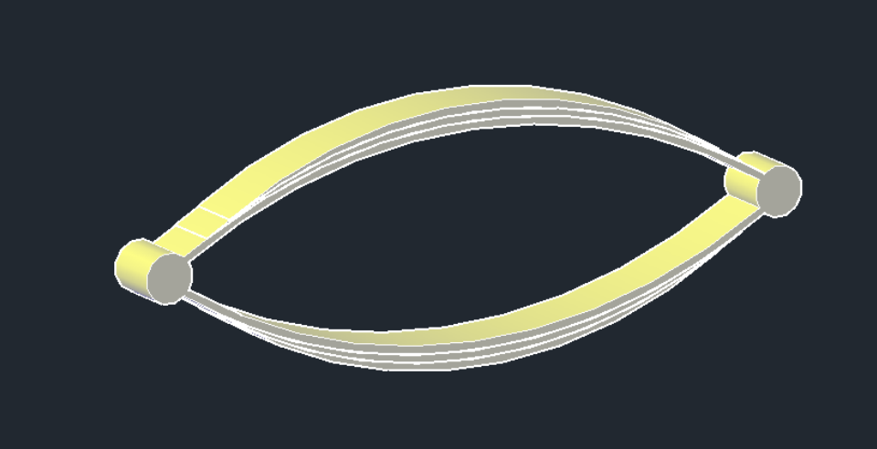

### Sistemul de prindere al suspensiilor

Pentru ca suspensiile să fie stabile, acestea sunt prinse cu ajutorul unui suport. Acesta a fost realizat cu funcția <i>EXTRUDE</i> aplicată pe desenele corespunzătoare 
vederii de sus.

  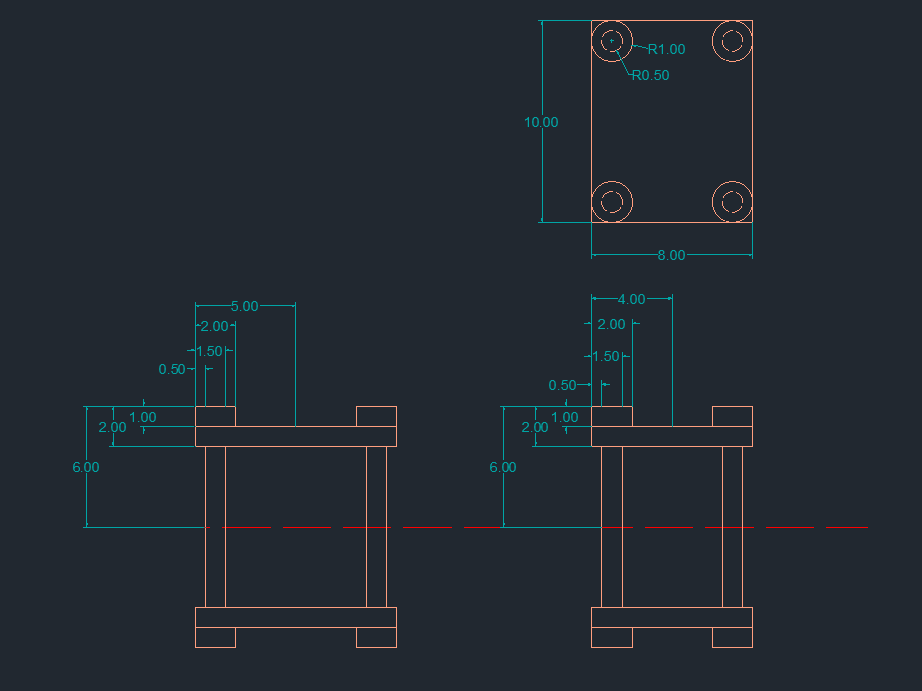
  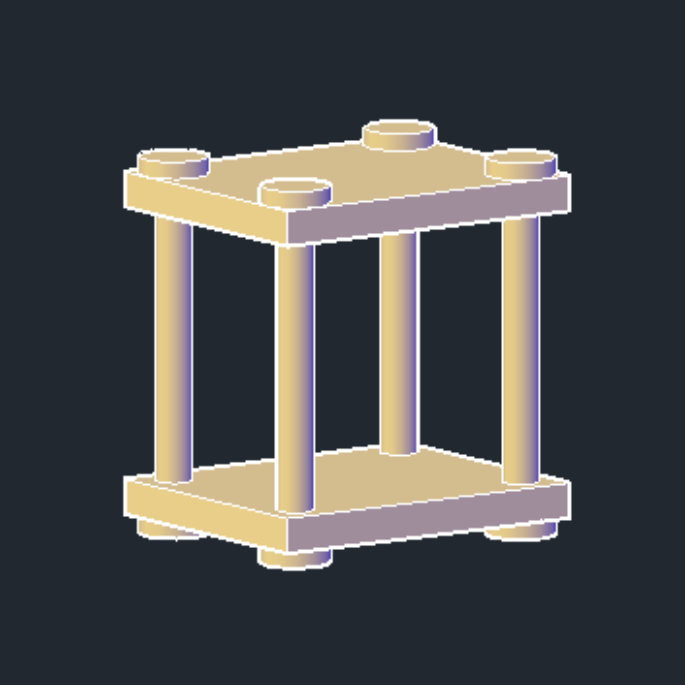

### Osia

Osia propriu-zisă a fost creată cu ajutorul comenzii <i>EXTRUDE</i> folosind: un pătrat pentru a adăuga lungimea de 150 de unități, un cerc pentru a adăuga lungimea de 20 de unități în ambele capete. Pe aceste margini cilindrice vor fi poziționate roțile.

  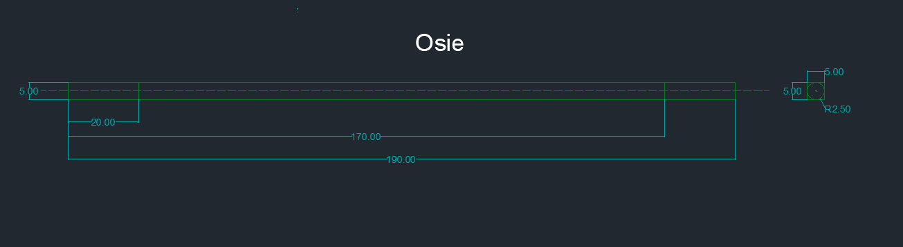
  

  

  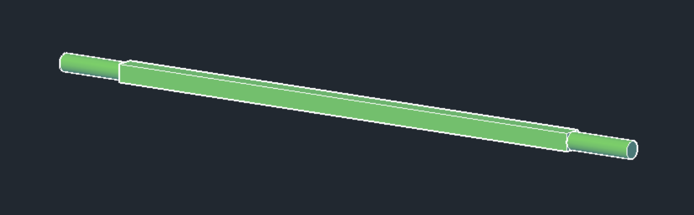

### Asamblarea componentelor
Componentele au fost asamblate folosind folosind <i>3DROTATE</i> și <i>MOVE</i>.

  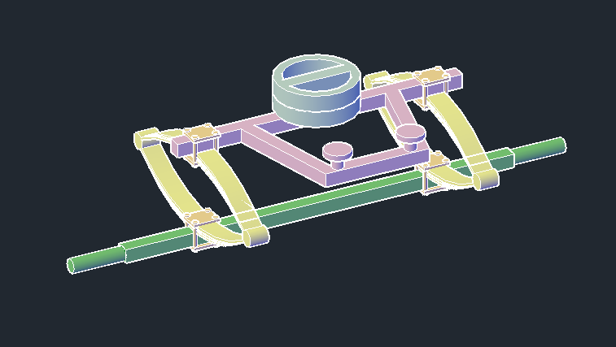

