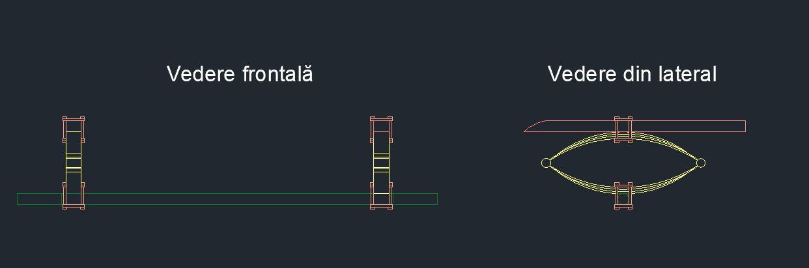

## Osia din spate

Câteva dintre elementele aflate pe osia din spate sunt comune cu cele de pe osia din față, și anume: osia propriu-zisă și suporturile de prindere a suspensiilor. Suspensiile din spate sunt realizate asemănător cu cele din față, însă diferă dimensiunile. În plus, toate componentele enumerate mai sus sunt atașate de cabină prin intermediul unor picioare aflate în prelungirea cabinei. Figura următoare este o imagine de ansamblu a acestor componente.

  

### Prelungirile cabinei

Pentru a crea acele prelungiri ale cabinei am folosit <i>EXTRUDE</i> pe următoarea schiță:

  

  

  
  

### Suspensiile

Suspensiile din spate au fost realizate prin aceleași proceduri ca suspensiile din față (folosind <i>EXTRUDE</i>), însă diferă dimensiunile.

  
  
  

### Asamblarea componentelor

Osia și suporturile cu care sunt prinse suspensiile sunt identice cu cele din față. La final, am asamblat componentele.

  
  

