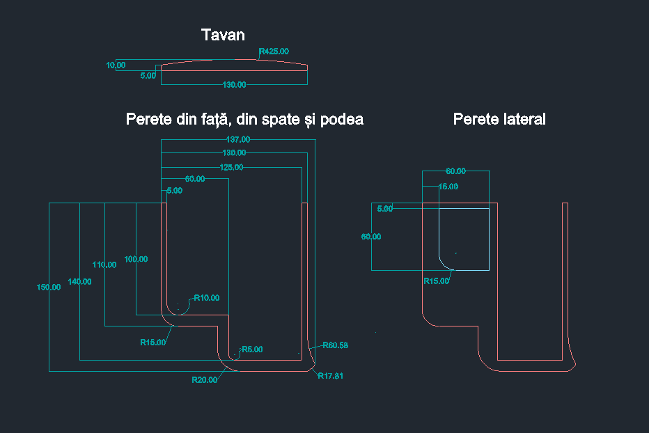
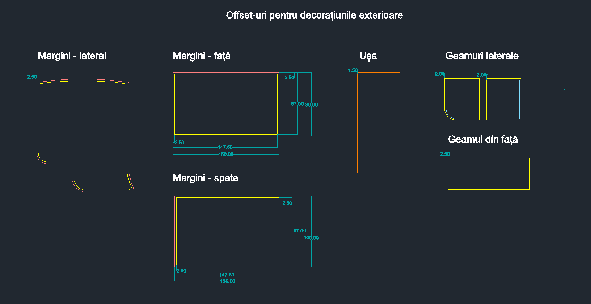
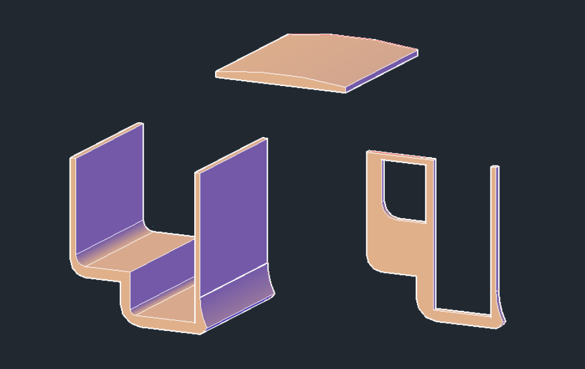

## Pereții

În realizarea pereților, am folosit: <i>LINE, ARC, FILLET, OFFSET</i> (pentru a adăuga grosime pereților). Am aplicat comanda <i>PRESSPULL</i> pe schițele corespunzătoare vederii din lateral pentru a crea obiectele 3D.
Pentru toate decorațiunile exterioare am folosit <i>OFFSET</i> astfel: offset de 2.5 unități în interior pentru marginile trăsurii, 2 în exterior pentru geamurile laterale, 2.5 în exterior pentru geamul din față și 1.5 în interior pentru uși.

  

  

  

  
