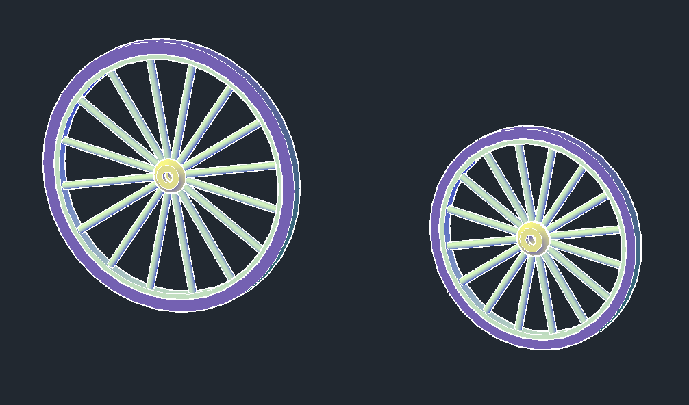
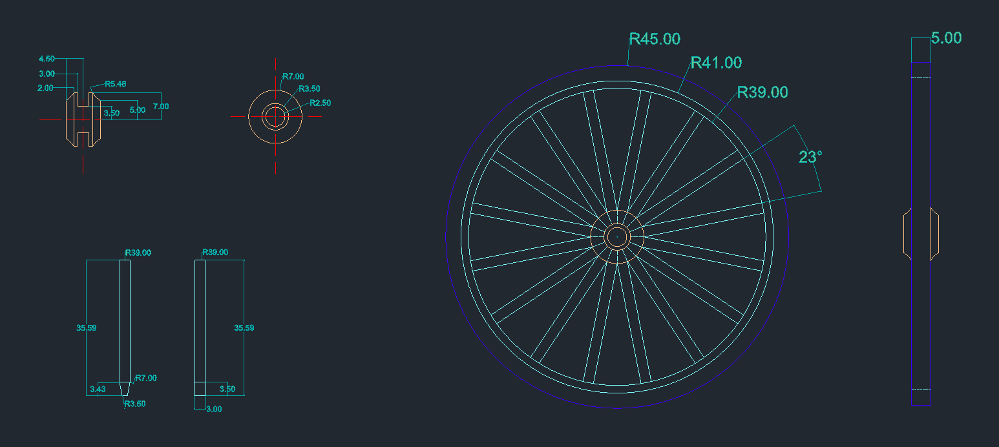
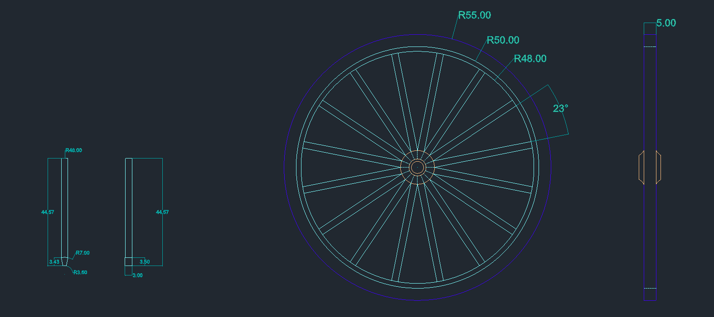

## Roțile

  Roțile din față și cele din spate au fost create similar, folosind aceleași metode, însă diferă dimensiunile. 
  

  

  

  

  Pentru butuci dimensiunile sunt identice pentru ambele tipuri de roți. Am creat o singură spiță, după care am folosit <i>POLARARRAY</i> pentru a o multiplica. Pentru a crea spița 3D am folosit <i>EXTRUDE</i> și <i>REVOLVE</i>, iar pentru marginile roții am aplicat <i>PRESSPULL</i>. În proiectare butucilor am folosit <i>ARC, LINE, MIRROR</i> pentru schițele 2D, și <i>REVOLVE</i> pentru componenta 3D. 

  

  

