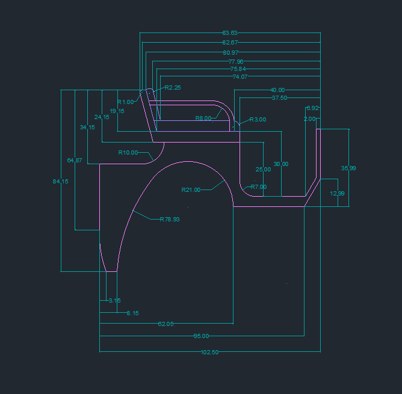
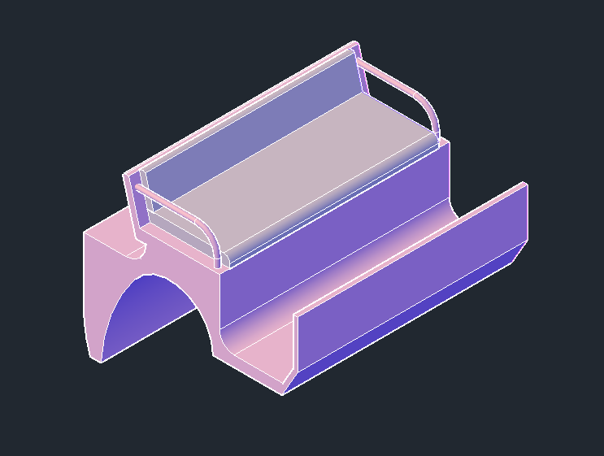

## Scaunul vizitiului

  În crearea scaunului, am folosit în schițele 2D următoarele comenzi: <i>LINE, ARC, CIRCLE, OFFSET</i> (în crearea mânerului), <i>FILLET</i> (pentru a rotunji colțurile). Am folosit <i>PRESSPULL</i> pe schița corespunzătoare perspectivei din lateral pentru a adăuga lățimea de 110 unități pentru scaunul propriu-zis și 100 de unități pentru perne.

  
  

