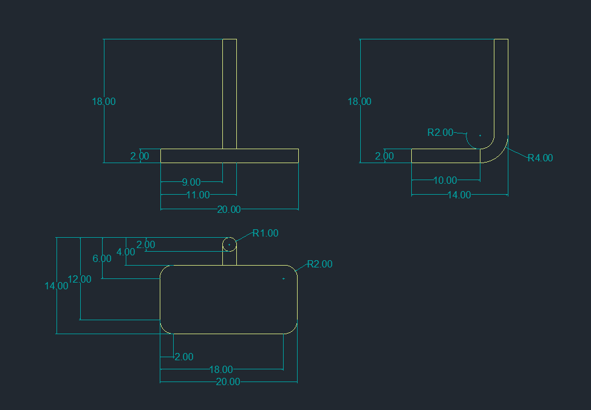

## Treapta

  Treapta a fost creată prin îmbinarea a două corpuri, realizate cu ajutorul comenzilor <i>SWEEP</i> (folosind vederea din lateral) și <i>EXTRUDE</i> (folosind vederea de sus). Le-am aliniat 
folosind <i>3DROTATE</i> și <i>MOVE</i> și le-am unit cu <i>UNION</i>, pentru a crea un singur corp.

  
    

