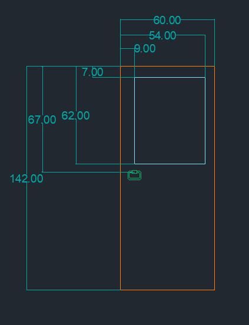
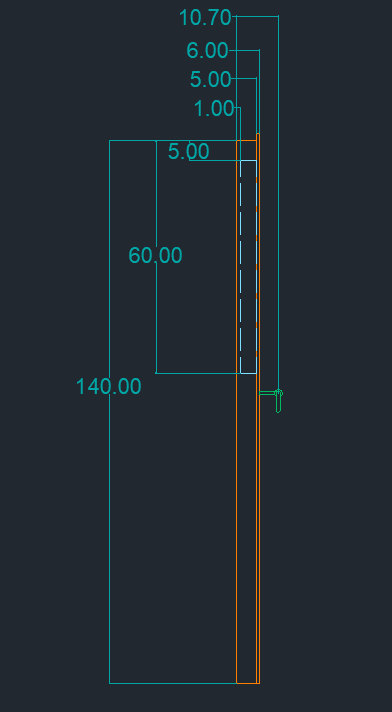
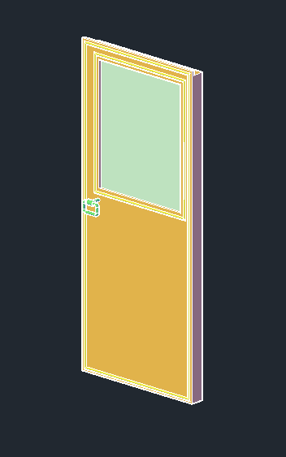

## Ușile laterale

  Deoarece ușile laterale sunt simetrice, am creat schițele pentru o singură ușă, pe care am multiplicat-o după crearea obiectelor 3D folosind funcția <i>COPY</i>. În schițele 2D am folosit <i>RECTANGLE, LINE, CIRCLE, ARC,</i> utilizând dimensiunile următoare. Atât ușa (fără mâner), cât și geamul au fost create folosind <i>EXTRUDE</i>.

  
  
    

